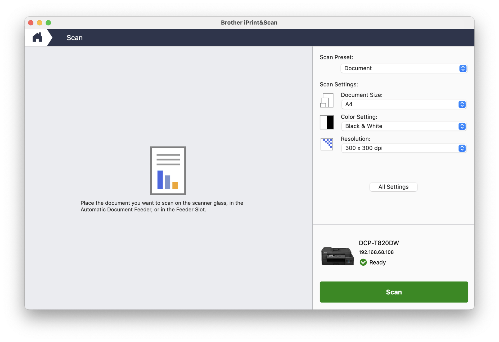

# Brother DCP-T820DW PDF Page Reordering Tool

## Problem Statement

The Brother DCP-T820DW is a multifunction printer that includes scanning capabilities. However, its Automatic Document
Feeder (ADF) does not support duplex scanning. This limitation means that there is no built-in way to scan both sides of
a document automatically.

To work around this limitation, I have employed a manual "hack":

1. Scan all odd-numbered pages in one pass.
2. Flip the entire stack of papers.
3. Scan all even-numbered pages in a second pass.

While this hack allows for scanning both sides of a document, it introduces new problems:

1. The resulting PDF contains all odd-numbered pages followed by all even-numbered pages in reverse order.
2. The pages are not in the correct reading sequence, making the document difficult to use.

For example, if you have a 6-page double-sided document, after using this hack, the PDF will have pages in this order:
1, 3, 5, 6, 4, 2

This incorrect page order makes the document unusable in its scanned form.

## Solution

To address the page ordering problem created by my manual duplex scanning hack, I've developed this Python script. The
script reorders the pages of the PDF file created by this two-pass scanning process, arranging them into the correct
sequence.

Key features of the solution:

1. Accepts a PDF with pages in the order resulting from the manual duplex scanning hack.
2. Automatically detects the number of pages and calculates the correct reordering.
3. Creates a new PDF with pages in the correct reading order.
4. Provides a simple command-line interface for easy use.

## Scanning Process

### First Pass (Odd Pages)

1. Place your multi-page document in the ADF with the odd-numbered pages facing down. This means the even pages will be
   facing up.
2. The top side of your document stack should go into the ADF first.
3. Set up your scan settings (resolution, color mode, etc.) as desired.
4. Initiate the scan. This will scan all odd-numbered pages (1, 3, 5, etc.).

### Second Pass (Even Pages)

1. Once the first pass is complete, take the entire stack of papers and flip it over as a bundle. Do not change the
   order of the pages or flip individual pages.
2. Place the flipped stack back in the ADF. Now the even-numbered pages will be facing down.
3. The top side of your flipped document stack (which was previously the bottom) should go into the ADF first.
4. Initiate the scan again. This will scan all even-numbered pages in reverse order (6, 4, 2, etc.).

Warning: It's crucial not to change the page order or flip each page individually between scans. Simply flip the entire
bundle together.

## Warnings

Please read the following warnings carefully to ensure the script works correctly:

1. Do not miss any pages: Ensure that every page of your document is scanned, including blank pages. The algorithm
   relies on the exact page count to work correctly.

2. Do not flip individual pages: When switching from scanning odd pages to even pages, flip the entire stack of papers
   together. Do not flip or rearrange individual pages.

3. Maintain page order: Do not change the order of pages at any point during the scanning process. The original document
   order must be preserved.

4. Include blank pages: If your document has blank pages (e.g., the last page is blank), make sure to scan these as
   well. Blank pages are crucial for maintaining the correct page count and order.

5. Avoid manual reordering: Do not attempt to manually reorder the pages before or after scanning. The script is
   designed to work with the specific order produced by the two-pass scanning process.

6. Consistent scanning direction: Ensure that you feed the papers into the ADF in the same direction for both scanning
   passes. The top of the document should enter the ADF first in both passes.

7. Double-check page count: Before running the script, verify that the number of pages in your scanned PDF matches
   exactly twice the number of sheets in your original document.

8. Handle with care: Be gentle when handling the paper stack between scans to avoid accidentally changing the order or
   orientation of the pages.

Failure to follow these warnings may result in incorrectly ordered pages in the final PDF, which may require manual
correction or rescanning of the entire document.

## Using Brother iPrint&Scan App

To scan your documents using the Brother DCP-T820DW printer and the Brother iPrint&Scan app, follow these steps:

1. Launch the Brother iPrint&Scan app.

2. On the main screen, click on the "Scan" icon.

   

3. In the Scan settings:
    - Set "Scan Preset" to "Document"
    - Choose your desired "Document Size" (e.g., A4)
    - Set "Color Setting"
    - Set "Resolution"

   

4. Place your document in the Automatic Document Feeder (ADF) as described in the [Scanning Process](#scanning-process) section of this README.

5. Click the "Scan" button to begin scanning. This is the [First Pass (Odd Pages)](#first-pass-odd-pages).

6. After scanning, you'll see a preview of your scanned pages. The first pass will show odd-numbered pages (e.g., 1, 3, 5).

7. For the [Second Pass (Even Pages)](#second-pass-even-pages), flip the entire document stack as described in the Scanning Process section. 

8. You should click on "Add Pages" to start scanning the second pass.

   

9. After completing the second pass, you'll have additional pages (e.g., 6, 4, 2) added to your document. The complete file will now contain pages in the order: 1, 3, 5, 6, 4, 2. With both passes completed, click "Save to PC" in the right sidebar.

10. In the save dialog:
    - Enter a filename
    - Ensure the file type is set to PDF
    - Choose your desired save location

    

11. Click "Save" to save your scanned document.

After completing both scanning passes, you'll have one PDF file with pages in the order: 1, 3, 5, 6, 4, 2. You can then use the Python script provided in this project to reorder these pages into the correct sequence.

Remember to follow the warnings and instructions in the [Scanning Process](#scanning-process) and [Warnings](#warnings) sections of this README to ensure the best results.


## Algorithm Explanation

The reordering algorithm works as follows:

1. Read the input PDF.
2. Calculate the total number of pages and split them into two halves.
3. Create a new PDF.
4. Iterate through the pages:
    - Add odd pages in order from the first half of the document.
    - Add even pages in reverse order from the second half of the document.
5. Save the new, correctly ordered PDF.

Here's a visual representation of the process:

```
Input PDF:  [1, 3, 5, 6, 4, 2]
                 |
                 v
Split in half: [1, 3, 5] [6, 4, 2]
                 |         |
                 v         v
Reorder:    [1,     3,     5    ]
             |      |      |
            [2,     4,     6    ]
                 |
                 v
Output PDF: [1, 2, 3, 4, 5, 6]
```

This process takes the oddly-ordered pages from the input PDF and rearranges them into the correct sequence in the
output PDF.

## Installation and Usage

### Prerequisites

- Python 3.6 or higher
- pip (Python package installer)
- Scanner applications (install these before proceeding):

  For macOS:
    1. Brother iPrint&Scan app
        - Download from: [App Store](https://apps.apple.com/us/app/brother-iprint-scan/id1193539993?mt=12)
    2. iPrint&Scan Push Scan Tool app
        - Download
          from: [Brother Support](https://support.brother.com/g/b/downloadlist.aspx?c=in&lang=en&prod=dcpt820dw_all&os=10080)

  For Windows:
    1. Brother iPrint&Scan app
        - Download
          from: [Brother Support](https://support.brother.com/g/b/downloadlist.aspx?c=in&lang=en&prod=dcpt820dw_all&os=10068)

  For iOS:
    1. Brother iPrint&Scan app
        - Download from: [App Store](https://apps.apple.com/us/app/brother-iprint-scan/id382775642)

  For Android:
    1. Brother iPrint&Scan app
        - Download
          from: [Play Store](https://play.google.com/store/apps/details?id=com.brother.mfc.brprint&hl=en_IN)

### Setup

1. Clone the repository:
   ```
   git clone https://github.com/ganeshrvel/brother-dcp-t820dw.git
   cd brother-dcp-t820dw
   ```

2. Create and activate a virtual environment:
   ```
   python3 -m venv venv
   source venv/bin/activate  # On Windows, use `venv\Scripts\activate`
   ```

3. Install the required packages:
   ```
   pip install -r requirements.txt
   ```

### Running the Script

Use the following command to run the script:

```
python adf_pages_correction.py --input="/path/to/your/input.pdf" --output="/path/to/your/output.pdf"
```

Replace `/path/to/your/input.pdf` with the path to your scanned PDF, and `/path/to/your/output.pdf` with the desired
path for the corrected PDF.

Example:

```
python adf_pages_correction.py --input="/Users/username/Downloads/sample/input-incorrect.pdf" --output="/Users/username/Downloads/sample/output-corrected.pdf"
```

The script will ask for confirmation before overwriting an existing output file.

## Contributing

Contributions to this project are welcome! Please fork the repository and submit a pull request with your changes.

## License

This project is open source and available under the [MIT License](LICENSE).